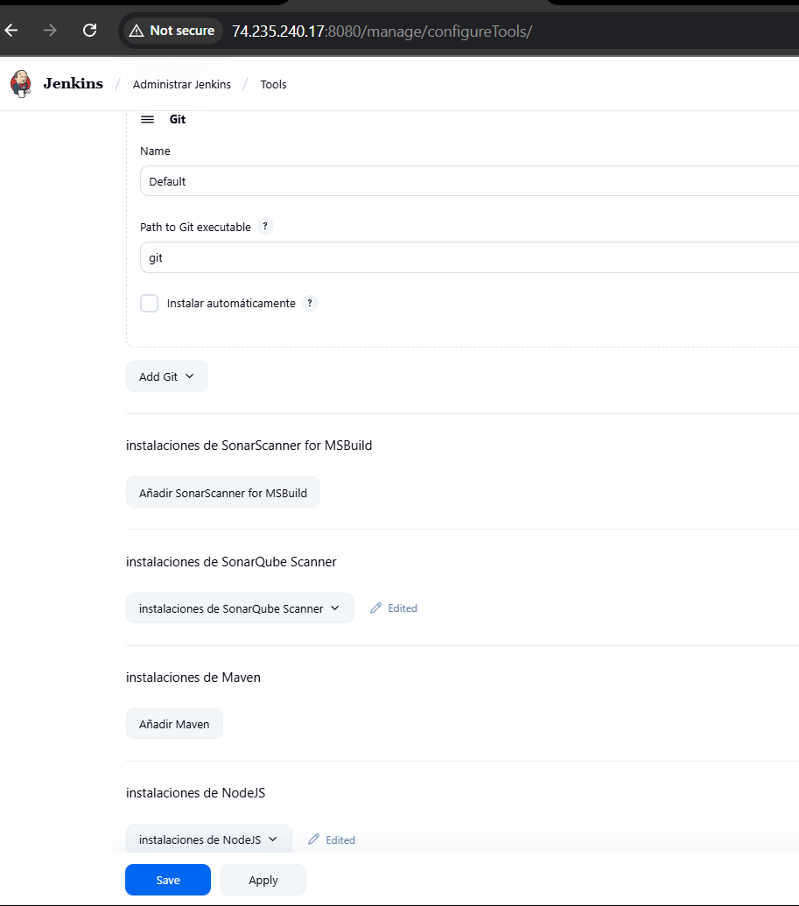
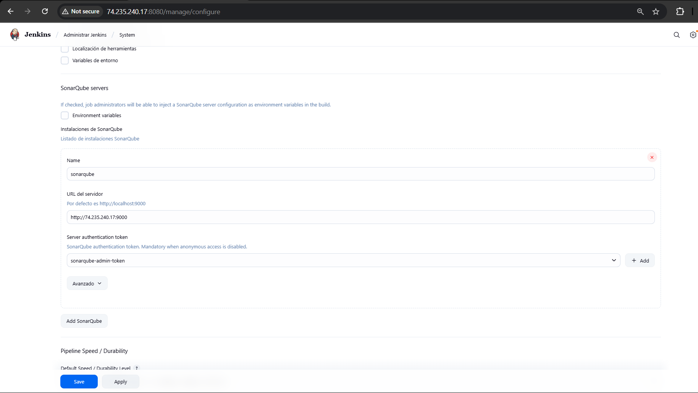
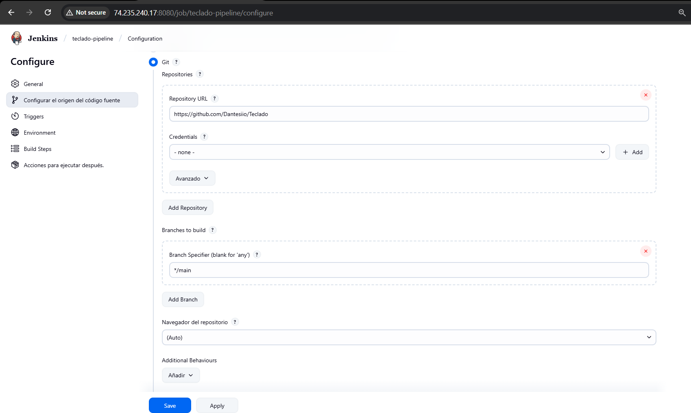
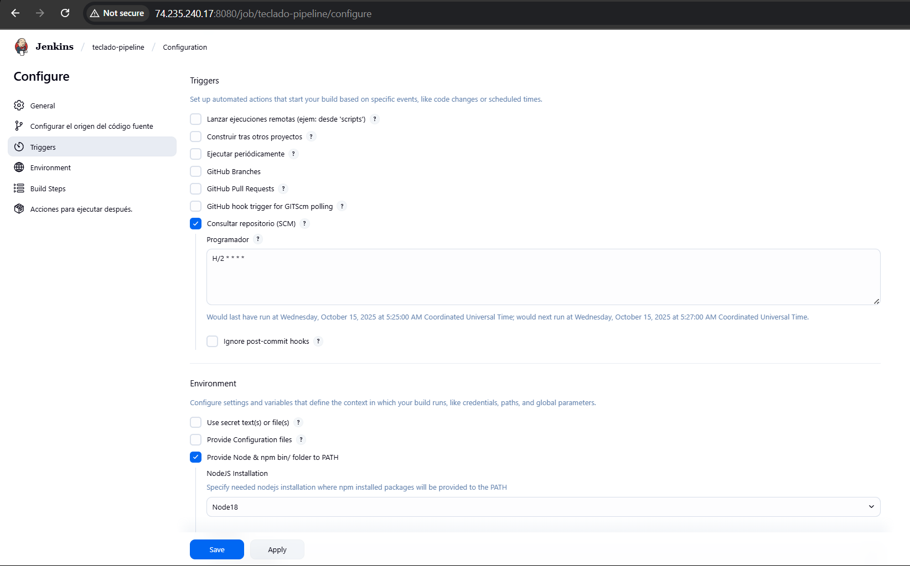
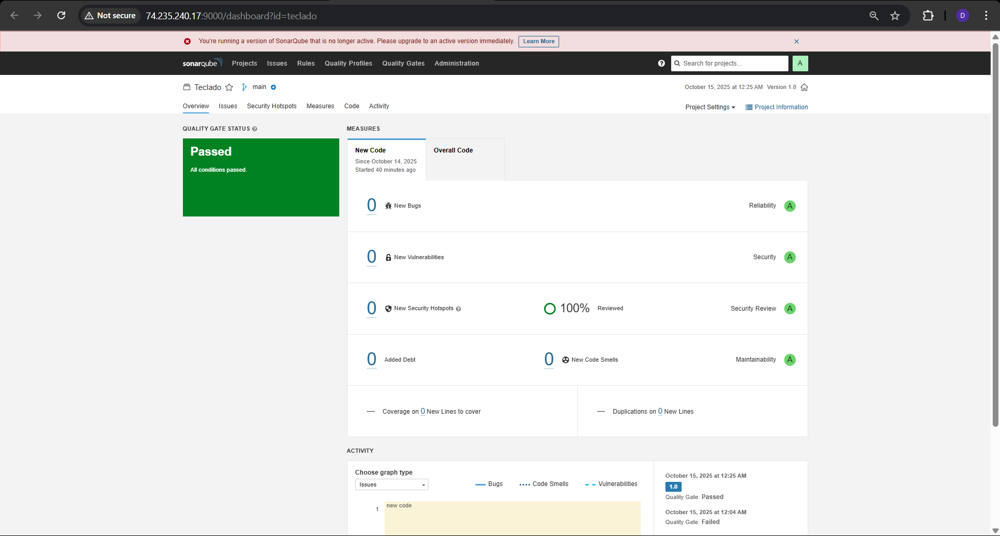
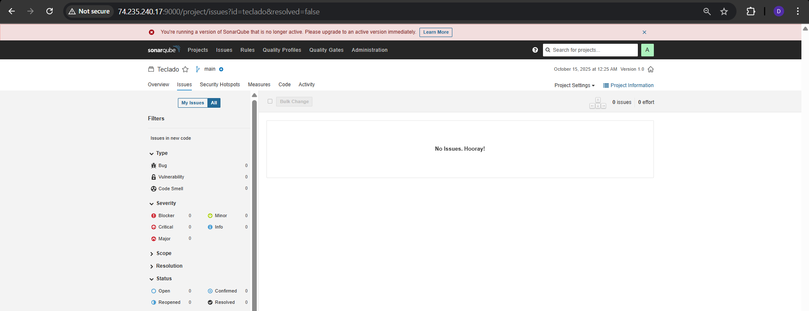
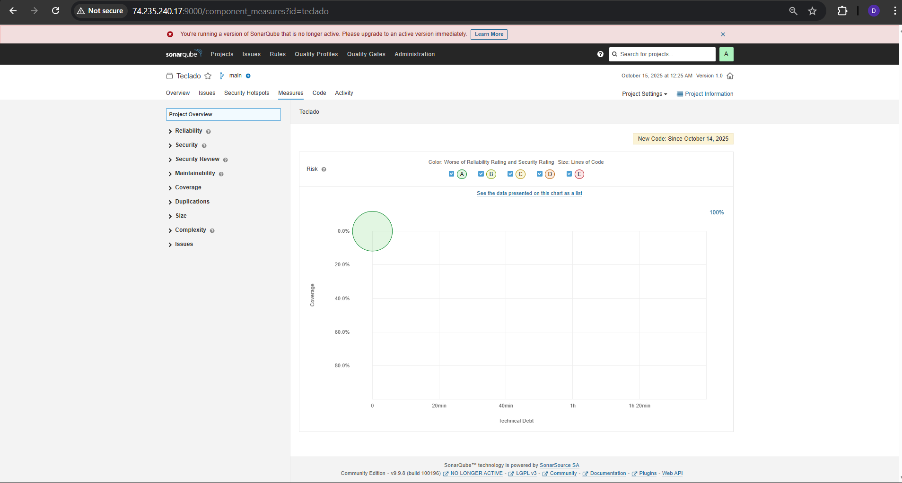
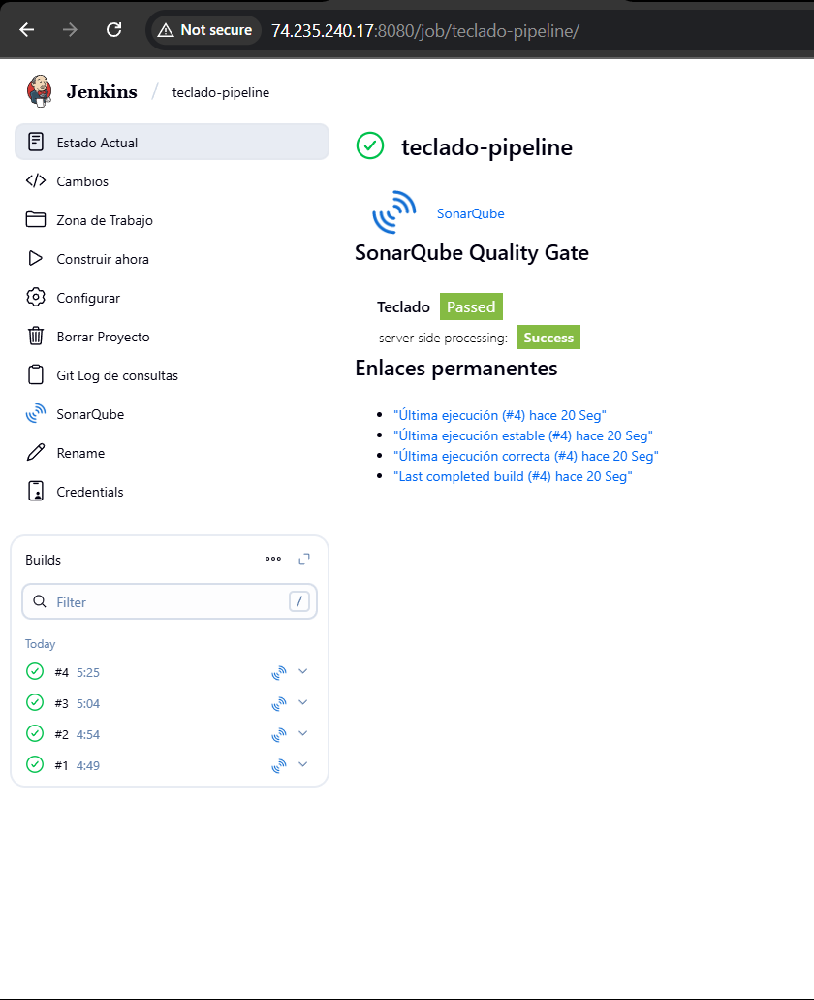

# Teclado

Aplicación estática de práctica de mecanografía. El contenido se publica dentro del stack Docker del host Jenkins mediante un contenedor Nginx, pero también puede ejecutarse localmente para desarrollo.

## Estructura

- `index.html`, `script.js`, `css/`: código de la aplicación web.
- `Dockerfile`: imagen mínima basada en `nginx:alpine` que sirve la aplicación.
- `Jenkinsfile`: pipeline de ejemplo para ejecutar análisis SonarQube desde Jenkins (opcional si usas job Freestyle).
- `sonar-project.properties`: configuración del scanner para SonarQube.
- `images/`: evidencias y pantallazos del CI/CD.

## Requisitos opcionales

- Node.js 18+ si deseas utilizar los scripts de `package.json`.
- Docker si quieres construir la imagen localmente.

## Ejecutar en local (modo desarrollo)

```bash
cd Teclado
npm install
npm run serve
# abrir http://localhost:8080
```

> El comando usa `http-server` vía `npx`. Si prefieres otro servidor estático, simplemente abre `index.html` en tu navegador.

## Construir imagen Docker

```bash
cd Teclado
docker build -t teclado:latest .
docker run --rm -p 8080:80 teclado:latest
# abrir http://localhost:8080
```

## Integración con el stack del taller

- El playbook de **ansible-pipeline** sincroniza el contenido de esta carpeta dentro de `/opt/devops/jenkins/teclado/site/` en la VM Jenkins.
- El servicio `teclado` del `docker-compose.yml` monta esa ruta y expone el sitio en el puerto 80 de la IP pública.
- Cualquier cambio que hagas aquí se desplegará al ejecutar de nuevo el playbook.

---

## CI con Jenkins + SonarQube

### Requisitos en Jenkins

- Plugins: **SonarQube Scanner for Jenkins**, **NodeJS**, **Git** (opcional: **GitHub** para webhooks).
- Tools:
  - **Git**: `git` en el PATH.
  - **SonarScanner**: *Install automatically*.
  - **NodeJS**: instalación llamada **Node18** con versión 18.x (LTS) y *Install automatically*.

**Captura – Tools configuradas**  


### Configuración del servidor SonarQube en Jenkins

- **Manage Jenkins → System → SonarQube Servers**  
  - **Name**: `sonarqube`  
  - **URL**: `http://74.235.240.17:9000`  
  - **Server authentication token**: credencial con el token de usuario (tipo *Secret text*).

**Captura – System (SonarQube server)**  


### Job Freestyle (utilizado en el taller)

1. **Origen del código**:  
   - **Git** → Repository URL: `https://github.com/Dantesiio/Teclado`  
   - Branches to build: `*/main`

2. **Environment**:  
   - Habilitar **Provide Node & npm bin/ folder to PATH** → **Node18**.

3. **Build Steps**:  
   - **Execute SonarQube Scanner**  
     - **Path to project properties**: `sonar-project.properties`  
     - (Dejar vacíos *Analysis properties* y *Additional arguments*: Jenkins inyecta URL/token.)

4. **Triggers** (dos alternativas):
   - Poll SCM: marcar **Consultar repositorio (SCM)** y usar la cron `H/2 * * * *` (polla cambios cada ~2 min).  
   - Webhook GitHub: marcar **GitHub hook trigger for GITScm polling** y crear webhook a `http://<jenkins>/github-webhook/`.

**Capturas – Configuración del job**  
  


### Pipeline as Code (opcional)

También puedes usar el `Jenkinsfile` del repo creando un job tipo **Pipeline** con “*Pipeline script from SCM*”. Ejemplo de stages principales: *Checkout*, *SonarQube Analysis*, *Quality Gate*.

---

## Quality Gate y revisión de hotspots

El quality gate exige **100% de *Security Hotspots Reviewed* en New Code**.  
El hotspot detectado por Sonar (uso de `Math.random()` en `script.js`) se marca como **Reviewed → Safe** porque es un uso **no criptográfico** (solo UI aleatoria).

**Capturas – SonarQube**

- **Dashboard – Passed**  
  

- **Issues – No issues**  
  

- **Measures – Overview**  
  

### Resultado en Jenkins

El job finaliza en **SUCCESS** y el *Quality Gate* aparece **Passed** con el link directo al análisis.

**Captura – Estado del job**  


---

## Troubleshooting

- **Node no encontrado durante el análisis JS**  
  Instalar plugin **NodeJS**, agregar tool **Node18** (18.x LTS) y activar **Provide Node & npm bin/ folder to PATH** en el job.

- **Token/Permisos SonarQube**  
  Crear token desde SonarQube (`Administration → Security → Tokens`), guardarlo como credencial *Secret text* y seleccionarlo en **Manage Jenkins → System → SonarQube Servers**.

- **No se dispara automático con push**  
  - Con *Poll SCM*: revisa el cron `H/2 * * * *`.  
  - Con *Webhook*: que el webhook de GitHub apunte a `http://<jenkins>:8080/github-webhook/` y el job tenga marcado **GitHub hook trigger for GITScm polling**.

---
